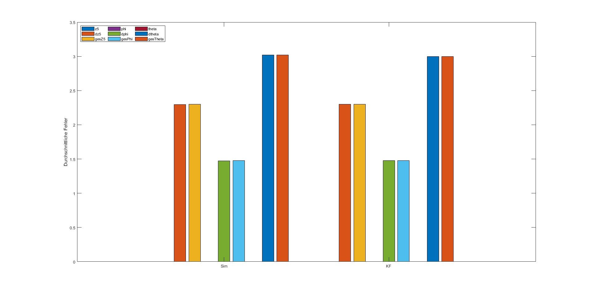
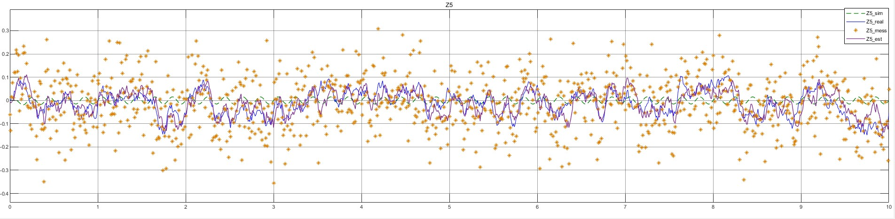
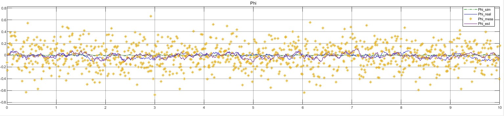
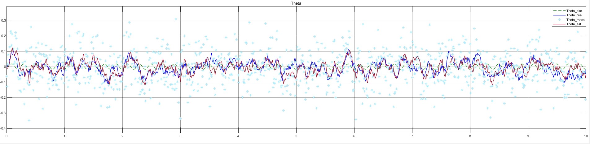
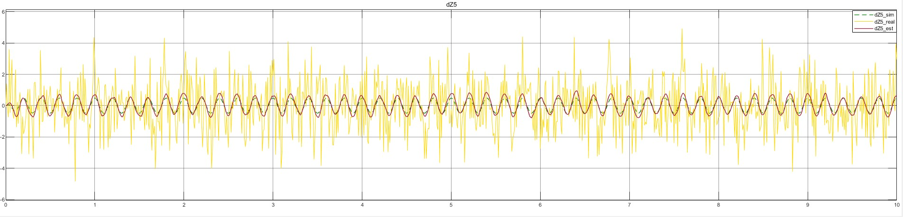
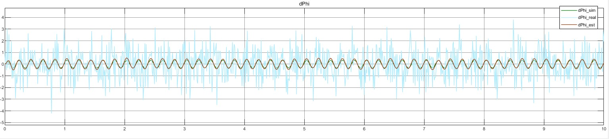
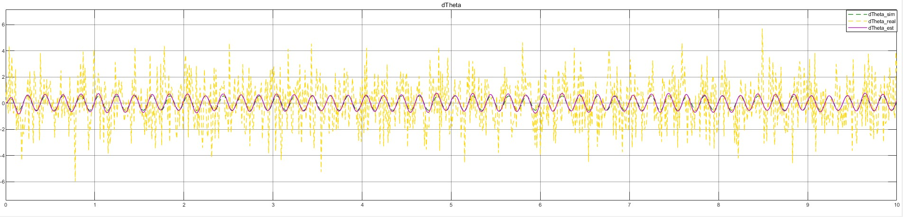

# 🚗 Vehicle Vertical Dynamics — State Estimation with Kalman Filter


A full state estimation pipeline for the **linear vertical dynamics of a passenger vehicle** with **7 degrees of freedom (DOF)**, implemented in MATLAB and Simulink. The system is excited by four independent road profile inputs, corrupted by process and measurement noise, and the full state vector (positions + velocities) is recovered using a **discrete-time Kalman Filter**.


Developed as an examination project for the university course:  
*„Zustands- und Parameterschätzung am Beispiel der KFZ-Längsdynamik"*

---

## 📋 Table of Contents

- [Physical Model](#-physical-model)
- [State-Space Formulation](#-state-space-formulation)
- [Kalman Filter Design](#-kalman-filter-design)
- [Implementation Architecture](#-implementation-architecture)
- [Results](#-results)
- [Project Structure](#-project-structure)
- [Getting Started](#-getting-started)
- [System Parameters](#-system-parameters)
- [Discussion & Limitations](#-discussion--limitations)

---

## 🏗 Physical Model

The vehicle is modelled as a **7-DOF linear mechanical system**:

| DOF | Symbol | Description |
|-----|--------|-------------|
| 1 | $z_1$ | Vertical displacement — front-left wheel mass |
| 2 | $z_2$ | Vertical displacement — front-right wheel mass |
| 3 | $z_3$ | Vertical displacement — rear-left wheel mass |
| 4 | $z_4$ | Vertical displacement — rear-right wheel mass |
| 5 | $z_5$ | Vertical displacement — sprung mass (vehicle body) |
| 6 | $\Phi$ | Roll angle — sprung mass |
| 7 | $\Theta$ | Pitch angle — sprung mass |

The four wheel masses $m_1, \ldots, m_4$ are each connected to the road via a **tyre spring-damper** ($k_R$, $d_R$) and to the sprung mass $m_5$ via **suspension spring-dampers** ($k_{Fv}$, $d_{Fv}$ front, $k_{Fh}$, $d_{Fh}$ rear). Road excitation enters through four independent base inputs $u_1, u_2, u_3, u_4$.

### Equation of Motion

$$\mathbf{M}\ddot{\mathbf{x}} + \mathbf{D}\dot{\mathbf{x}} + \mathbf{K}\mathbf{x} = \mathbf{F}(t)$$

where:

$$\mathbf{M} = \mathrm{diag}(m_1,\ m_2,\ m_3,\ m_4,\ m_5,\ J_\Phi,\ J_\Theta)$$

$$\mathbf{x} = \begin{bmatrix} z_1 & z_2 & z_3 & z_4 & z_5 & \Phi & \Theta \end{bmatrix}^\top$$

The force vector $\mathbf{F}$ is driven by the road excitations:

$$\mathbf{F} = \begin{bmatrix} k_R u_1 + d_R \dot{u}_1 \\ k_R u_2 + d_R \dot{u}_2 \\ k_R u_3 + d_R \dot{u}_3 \\ k_R u_4 + d_R \dot{u}_4 \\ 0 \\ 0 \\ 0 \end{bmatrix}$$

The stiffness matrix $\mathbf{K}$ and damping matrix $\mathbf{D}$ couple all bodies through the suspension geometry (half-track $b$, front wheelbase $l_v$, rear wheelbase $l_h$).

---

## 📐 State-Space Formulation

The second-order ODE is rewritten as a **first-order state-space system** by augmenting positions with velocities:

$$\mathbf{x}_{state} = \begin{bmatrix} z_1 & z_2 & z_3 & z_4 & z_5 & \Phi & \Theta & \dot{z}_1 & \dot{z}_2 & \dot{z}_3 & \dot{z}_4 & \dot{z}_5 & \dot{\Phi} & \dot{\Theta} \end{bmatrix}^\top \in \mathbb{R}^{14}$$

The continuous-time system:

$$\dot{\mathbf{x}} = \mathbf{A}_c \mathbf{x} + \mathbf{B}_c \mathbf{u}$$

$$\mathbf{y} = \mathbf{C} \mathbf{x}$$

The system matrix has the standard mechanical structure:

$$\mathbf{A}_c = \begin{bmatrix} \mathbf{0}_{7 \times 7} & \mathbf{I}_{7 \times 7} \\ -\mathbf{M}^{-1}\mathbf{K} & -\mathbf{M}^{-1}\mathbf{D} \end{bmatrix} \in \mathbb{R}^{14 \times 14}$$

The input vector $\mathbf{u} \in \mathbb{R}^8$ contains both road displacements and velocities:

$$\mathbf{u} = \begin{bmatrix} u_1 & u_2 & u_3 & u_4 & \dot{u}_1 & \dot{u}_2 & \dot{u}_3 & \dot{u}_4 \end{bmatrix}^\top$$

### Measurement Model

Only the **7 positions** are measured — velocities are unobservable directly:

$$\mathbf{y} = \mathbf{C}\mathbf{x}, \quad \mathbf{C} = \begin{bmatrix} \mathbf{I}_{7 \times 7} & \mathbf{0}_{7 \times 7} \end{bmatrix} \in \mathbb{R}^{7 \times 14}$$

---

## 🔷 Kalman Filter Design

### Discretization

The continuous system is discretized using **forward Euler** (valid for the small sampling time $T_s = 0.01\,\text{s}$):

$$\mathbf{A}_d = \mathbf{I} + T_s \mathbf{A}_c, \qquad \mathbf{B}_d = T_s \mathbf{B}_c$$

The discrete stochastic system model:

$$\mathbf{x}_{k+1} = \mathbf{A}_d \mathbf{x}_k + \mathbf{B}_d \mathbf{u}_k + \mathbf{w}_k, \qquad \mathbf{w}_k \sim \mathcal{N}(\mathbf{0}, \mathbf{Q})$$

$$\mathbf{y}_k = \mathbf{C}\mathbf{x}_k + \mathbf{v}_k, \qquad \mathbf{v}_k \sim \mathcal{N}(\mathbf{0}, \mathbf{R})$$

### Noise Covariance Matrices

$$\mathbf{Q} = T_s^2 \cdot \mathrm{diag}\left(\sigma_z^2,\sigma_z^2,\sigma_z^2,\sigma_z^2,\sigma_z^2,\sigma_\Phi^2,\sigma_\Theta^2,\sigma_{\dot{z}}^2,\sigma_{\dot{z}}^2,\sigma_{\dot{z}}^2,\sigma_{\dot{z}}^2,\sigma_{\dot{z}}^2,\sigma_{\dot{\Phi}}^2,\sigma_{\dot{\Theta}}^2\right)$$

$$\mathbf{R} = \mathrm{diag}\left(\sigma_{m,z}^2,\sigma_{m,z}^2,\sigma_{m,z}^2,\sigma_{m,z}^2,\sigma_{m,z}^2,\sigma_{m,\Phi}^2,\sigma_{m,\Theta}^2\right)$$

### Filter Equations

**Prediction step:**

$$\hat{\mathbf{x}}_{k|k-1} = \mathbf{A}_d \hat{\mathbf{x}}_{k-1|k-1} + \mathbf{B}_d \mathbf{u}_k$$

$$\mathbf{P}_{k|k-1} = \mathbf{A}_d \mathbf{P}_{k-1|k-1} \mathbf{A}_d^\top + \mathbf{Q}$$

**Kalman gain:**

$$\mathbf{K}_k = \mathbf{P}_{k|k-1} \mathbf{C}^\top \left(\mathbf{C}\,\mathbf{P}_{k|k-1}\mathbf{C}^\top + \mathbf{R}\right)^{-1}$$

**Measurement update:**

$$\hat{\mathbf{x}}_{k|k} = \hat{\mathbf{x}}_{k|k-1} + \mathbf{K}_k\!\left(\mathbf{y}_k - \mathbf{C}\hat{\mathbf{x}}_{k|k-1}\right)$$

$$\mathbf{P}_{k|k} = \mathbf{P}_{k|k-1} - \mathbf{K}_k\!\left(\mathbf{C}\,\mathbf{P}_{k|k-1}\mathbf{C}^\top + \mathbf{R}\right)\mathbf{K}_k^\top$$

The Kalman gain computation uses MATLAB's `\` (matrix right-division) to avoid explicit matrix inversion, improving numerical stability.

---

## 🧩 Implementation Architecture

The Simulink model is structured into four clearly separated subsystems:

```
vertical_dynamics_vehicle.slx
│
├── 🔴 Einlesen
│       Road excitation signals (u1–u4, du1–du4) from MATLAB workspace
│
├── 🟢 Vertikaldynamik-Modellierung
│       ├── Ideal plant         — noise-free ground truth
│       └── Real plant          — with Gaussian process noise (white noise)
│
├── 🩵 Kalman Filter
│       └── MATLAB Function block → kalman_filter.m
│               Inputs:  u (8×1), y_measured (7×1), system params, Q, R, P0, x0, Ts
│               Output:  x_est (14×1) — full state estimate
│
├── 🔵 Darstellung der Ergebnisse
│       Scope blocks per DOF: ideal / real / measured / estimated
│
└── 🟣 Übertragung der Ergebnisse in Arbeitsraum
        Exports all signals back to MATLAB workspace for analysis
```

The KF block is implemented as a **MATLAB Function block** using `persistent` variables to maintain state across time steps — a clean and efficient approach for Simulink integration.

---

## 📊 Results

The model was run **N = 10 times** with different random seeds. Mean Square Error (MSE) was computed between:
- **Sim**: real (noisy) vs. ideal (ground truth)  
- **KF**: estimated vs. ideal (ground truth)

| | $z_5$ | $\dot{z}_5$ | ges. $z_5$ | $\Phi$ | $\dot{\Phi}$ | ges. $\Phi$ | $\Theta$ | $\dot{\Theta}$ | ges. $\Theta$ |
|---|---|---|---|---|---|---|---|---|---|
| **Sim** | 0.0027 | 2.2978 | 2.3014 | 0.0014 | 1.4751 | 1.4765 | 0.0016 | 3.0187 | 3.0203 |
| **KF** | 0.0015 | 2.3003 | 2.3017 | 0.0018 | 1.4761 | 1.4779 | 0.0013 | 2.9974 | 2.9987 |

### Displacement & Rotation Estimates
| $z_5$ | $\Phi$ | $\Theta$ |
|---|---|---|
|  |  |  |

### Velocity Estimates
| $\dot{z}_5$ | $\dot{\Phi}$ | $\dot{\Theta}$ |
|---|---|---|
|  |  |  |

**Key observations:**
- The KF estimated positions ($z_5$, $\Phi$, $\Theta$) match the real values closely — error comparable to the simulation noise floor
- Velocity estimates ($\dot{z}_5$, $\dot{\Phi}$, $\dot{\Theta}$) are recovered entirely from the filter, as they are **not directly measured** — demonstrating the core value of the KF
- The slightly higher $z_5$ position error in the KF compared to Sim is attributed to the simplification of using equal noise parameters for all translational DOFs

---

## 📁 Project Structure

```
vehicle-vertical-dynamics-kf/
│
├── README.md
├── LICENSE
├── .gitignore
│
├── src/
│   ├── main.m                        ← Main script: parameters, excitation, Monte Carlo loop
│   ├── kalman_filter.m               ← Kalman Filter MATLAB Function (called by Simulink)
│   └── vertical_dynamics_vehicle.slx  ← Simulink model (plant + noise + KF + scopes)
│
├── docs/
│   └── report.pdf                    ← Full project report (German)
│
└── results/
    └── figures/
        ├── z5_estimation.jpg
        ├── phi_estimation.jpg
        ├── theta_estimation.jpg
        ├── velocity_z5.jpg
        └── mean_error_histogram.jpg
```

---

## 🚀 Getting Started

### Requirements

- MATLAB R2022a or later
- Simulink
- Control System Toolbox
- System Identification Toolbox (for `goodnessOfFit`)

### Running the Simulation

1. Clone the repository:
   ```bash
   git clone https://github.com/navis-stella/vehicle-vertical-dynamics-kf.git
   cd vehicle-vertical-dynamics-kf
   ```

2. Open MATLAB and navigate to the `src/` folder:
   ```matlab
   cd src
   ```

3. Run the main script:
   ```matlab
   main
   ```
   This will:
   - Initialize all system parameters and noise covariances
   - Generate road excitation signals
   - Open and run `vertical_dynamics_vehicle.slx` for N = 10 Monte Carlo iterations
   - Export all results to the MATLAB workspace
   - Plot the mean MSE histogram

4. To inspect individual signals, open the Simulink model and run it directly:
   ```matlab
   open('vertical_dynamics_vehicle.slx')
   sim('vertical_dynamics_vehicle.slx', 10)
   ```

### Tuning the Filter

The filter performance is sensitive to the noise covariance parameters in `main.m`. Adjust these values to explore the trade-off between responsiveness and noise rejection:

```matlab
% Process noise standard deviations
sigma_z      = 1.5;   % translational DOFs [m]
sigma_dz     = 1.1;   % translational velocities [m/s]
sigma_phi    = 1.2;   % roll angle [rad]
sigma_dphi   = 1.6;   % roll rate [rad/s]
sigma_theta  = 1.7;   % pitch angle [rad]
sigma_dtheta = 1.3;   % pitch rate [rad/s]

% Measurement noise standard deviations
sigma_mz     = 0.1;   % position sensors [m]
sigma_mphi   = 0.2;   % roll angle sensor [rad]
sigma_mtheta = 0.1;   % pitch angle sensor [rad]
```

> **Tip:** Increasing `sigma_mz` (trusting the model more) makes the filter smoother but slower to react. Decreasing it (trusting the measurements more) makes it more responsive but noisier.

---

## ⚙️ System Parameters

| Parameter | Value | Unit | Description |
|-----------|-------|------|-------------|
| $m_1 = m_2 = m_3 = m_4$ | 50 | kg | Unsprung wheel masses |
| $m_5$ | 1200 | kg | Sprung vehicle body mass |
| $J_\Phi$ | 500 | kg·m² | Roll moment of inertia |
| $J_\Theta$ | 2000 | kg·m² | Pitch moment of inertia |
| $k_R$ | 100000 | N/m | Tyre stiffness |
| $k_{Fv}$ | 2500 | N/m | Front suspension stiffness |
| $k_{Fh}$ | 2200 | N/m | Rear suspension stiffness |
| $d_R$ | 250 | Ns/m | Tyre damping |
| $d_{Fv}$ | 1500 | Ns/m | Front suspension damping |
| $d_{Fh}$ | 2000 | Ns/m | Rear suspension damping |
| $b$ | 1.4 | m | Track width |
| $l_v$ | 1.9 | m | Front wheelbase |
| $l_h$ | 1.8 | m | Rear wheelbase |
| $T_s$ | 0.01 | s | Sampling time |
| $T_{sim}$ | 10 | s | Simulation duration |

---

## 💬 Discussion & Limitations

**What works well:**
- The KF successfully recovers all 14 states including the 7 unmeasured velocities
- MSE of estimated states is comparable to the simulation noise floor, confirming optimal filter tuning
- The modular Simulink architecture cleanly separates the plant, noise, filter, and visualisation

**Known limitations and potential improvements:**

| Limitation | Potential improvement |
|---|---|
| Equal noise for all translational DOFs | Tune individual `σ` per wheel mass for better $z_5$ estimation |
| Linear model only | Extend to nonlinear model (e.g. nonlinear damper) + use EKF/UKF |
| Positions-only measurement | Add accelerometer model to also measure $\ddot{z}$ for richer observation |
| No parameter estimation | Extend to joint state-parameter estimation (e.g. estimate $k_{Fv}$ online) |

---

## 📄 License

This project is licensed under the MIT License — see [LICENSE](LICENSE) for details.

---

## 👤 Author

Developed as an examination project in the module  
*„Zustands- und Parameterschätzung am Beispiel der KFZ-Längsdynamik"*  

Feel free to reach out via GitHub Issues for questions or suggestions.
